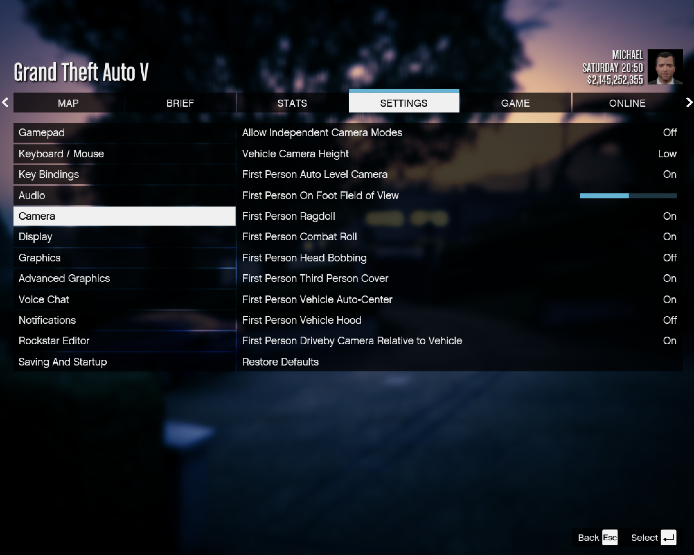
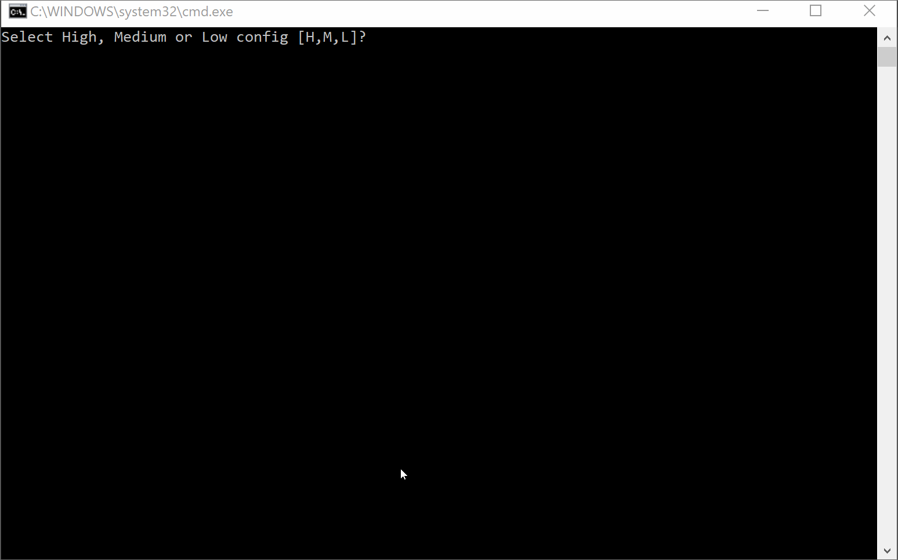

## Quickstart

Jump to **[Tips/Troubleshooting](#Tips/Troubleshooting)**

### Step 0: Pre-requisites

- Get a tool that can unpack **[Rar files](<https://en.wikipedia.org/wiki/RAR_(file_format)>)** (A good option is **[WinRar](https://www.win-rar.com/open-rar-file.html?&L=0)** but many others exist as well)

- Install GTAV & note the location where GTA5.exe is installed

### Step 1: Prep environment

- Launch GTA5 and enable the following options in settings:

```
Settings> Gamepad> Targeting Mode                  : Free Aim
Settings> Camera>  First Person Head Bobbing       : Off
Settings> Camera>  First Person Third Person Cover : On
Settings> Camera>  First Person Vehicle Hood       : Off
Settings> Saving And Startup> Startup Flow         : "Load into Story Mode"
```



### Step 2: Download & Unpack

- Download Rar archive from here: **[https://github.com/LukeRoss00/gta5-real-mod/releases/](https://github.com/LukeRoss00/gta5-real-mod/releases/)**

- Find GTA5.exe and "unpack" all files in the archive using a tool like Winrar into the same directory as GTA5.exe

**Note:** Depending on your installation, the GTA5.exe might be located in one of the following default locations:
| **Source/Launcher** | **Default Path** |
| ----------------------- | ----------------------------------------------------------------------- |
| Steam | C:\\Program Files (x86)\\Steam\\steamapps\\common\\Grand Theft Auto V |
| EPIC Games | C:\\Program Files\\Epic Games\\GTAV |
| Social Club/Other | C:\\Program Files\\Rockstar Games\\Grand Theft Auto V |

**Note:** The archive file will be named something like _[GTAV_REAL_mod_by_LukeRoss_r6.rar](https://github.com/LukeRoss00/gta5-real-mod/releases/download/r6/GTAV_REAL_mod_by_LukeRoss_r6.rar)_

### Step 2a: Update ScriptHookV

VR capability can be broken by software updates, the easiest way to avoid this is to use the latest version of _ScriptHookV.dll_

- Download the latest "Script Hook V" library (written by Alexander Blade) from here: **[http://www.dev-c.com/gtav/scripthookv](http://www.dev-c.com/gtav/scripthookv)**

- Unzip the ScriptHookV (_ScriptHookV_1.0.XXXX.Y.zip_) into the same directory as GTA5.exe

**Note:** Select "yes" to any warnings about overwriting files in the directory

### Step 3: Select graphics level

- If already running, completely shut down and exit GTA5.exe

- Open the directory where you unpacked the Rar file and launch the **RealConfig.bat** file

- Depending on your system, on the prompt select **L** (low), **M** (medium), or **H** (high) to configure graphics settings

- If you're unsure, select **M** to start-- you can always re-run this script later



**Note:** This operation will modify your _settings.xml_ file, the original will be backed up as _settings_ori.xml_ (default location is **Documents\Rockstar Games\GTA V**)

### Step 4: Launch into VR

- Get a VR system ready and then launch GTAV.exe

### Step 5: Tweak & modify

For a more thorough writeup with advanced configuration options, see the main **[README file](https://github.com/LukeRoss00/gta5-real-mod/blob/master/README.md)**

|                                                               Item                                                                |
| :-------------------------------------------------------------------------------------------------------------------------------: |
|            **[Recentering your view in VR](https://github.com/LukeRoss00/gta5-real-mod#recentering-your-view-in-vr)**             |
| **[Position Tracking Tips](https://github.com/LukeRoss00/gta5-real-mod#position-tracking-animations-and-the-players-body-model)** |
|          **[Advanced tweaking and hotkeys](https://github.com/LukeRoss00/gta5-real-mod#advanced-tweaking-and-hotkeys)**           |
|      **[More advanced graphics tweaking<br/>](https://github.com/LukeRoss00/gta5-real-mod#more-advanced-graphics-tweaking)**      |
|    **[Advanced screen resolution tweaks](https://github.com/LukeRoss00/gta5-real-mod#even-more-advanced-resolution-tweaking)**    |

### Tips/Troubleshooting

- This should **NOT** be used with network/multiplayer mode

- In 1st-person mode, move your head to determine the character's orientation in the game world

- You can use a mouse/keyboard but a simpler route is to use a controller gamepad

- If you encounter a lot of tear or jitters, try tapping F11 and select Numpad 2 to toggle stereo rendering

### Hotkeys

Tap F-11 to enable hotkeys (these are disabled by default to avoid conflicts with other software)

| Key      | Description                                                                                   |
| :------- | :-------------------------------------------------------------------------------------------- |
| 0        | Cycle stereo mode in cutscenes (normal, dynamic, flat screen) - dynamic at start              |
| T        | Cycle dominant eye for aiming down sights (none, left, right) - right at start                |
| Y        | Cycle heading control (always, only when aiming, never) - always at start                     |
| U        | Toggle pitch control - on at start                                                            |
| I        | Toggle decoupled 3rd person camera - on at start                                              |
| O        | Toggle view matrix fix enable - on at start                                                   |
| J        | Cycle pitch mode in cutscenes (absolute, relative, cut relative) - cut relative at start      |
| K        | Toggle full camera tracking in cutscenes - on at start                                        |
| '        | Toggle slow motion - off at start                                                             |
| N        | Toggle FPS counter - off at start                                                             |
| -        | Cycle HUD tracking mode (normal, force fixed, force headlocked, developer) - normal at start  |
| End      | Toggle gyro stabilization of view in vehicle - off at start                                   |
| NUMPAD / | Recenter HMD - centered at start                                                              |
| NUMPAD . | Cycle zoom override (never, only cutscenes, always except cutscenes, always) - never at start |
| NUMPAD 0 | Toggle position tracking - on at start                                                        |
| NUMPAD 2 | Toggle stereo rendering (alternate eyes) - on at start                                        |
| NUMPAD 3 | Toggle darts/tennis FOV override - on at start                                                |
